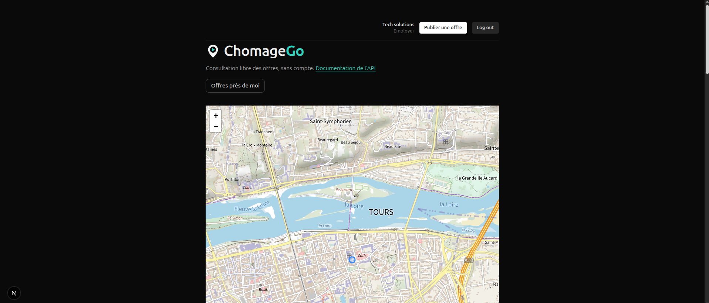
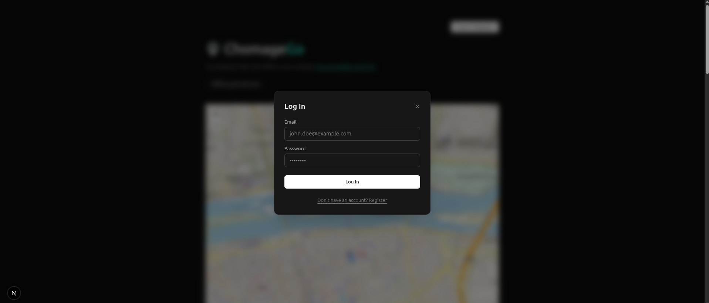
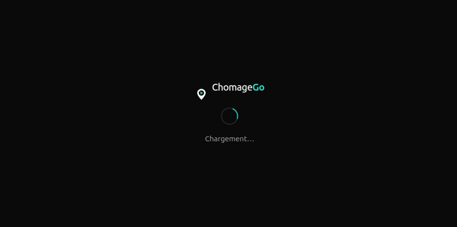
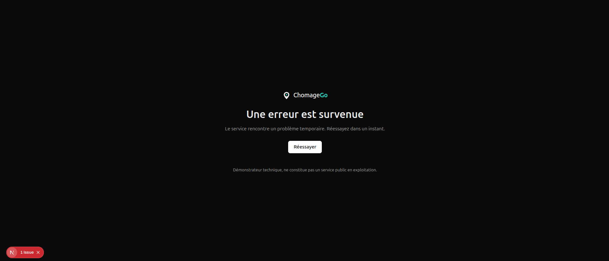

# Retrait du bloc marque de l'État, relevé des emplacements

**Demandé par** : Benjamin Sellami, email du 2026-09-07 (échéance 18h00)
**Objet** : retrait de toute référence visuelle à l'État des interfaces du démonstrateur.

Ce document liste **tous les endroits où le bloc-marque, la charte ou une référence à
l'État apparaissaient**, et ce qui a été fait pour chacun. Les captures « après » des
cinq écrans les plus visibles sont reproduites en **section 4** : page d'accueil, page de
connexion, liste des offres avec le pied de page, écran de chargement, page d'erreur.

---

## 1. Identité neutre retenue (les trois lignes demandées)

> **Typographie** : aucune police téléchargée, pile système (`ui-sans-serif, system-ui,
> Segoe UI, Roboto, Arial`). Choix volontaire : une police système ne peut être confondue
> avec Marianne, ne pose aucune question de licence, et ne fait sortir aucun fichier de
> police du démonstrateur.
> **Couleur primaire** : teal `#0F766E` (clair) / `#2DD4BF` (sombre), retenue parce
> qu'elle est chromatiquement éloignée du bleu institutionnel `#1B3A6B` — aucun risque de
> lecture « couleur de l'État » — tout en gardant un contraste AA sur les deux thèmes.
> **Application** : une seule variable CSS (`--color-accent`) et une seule variable de
> police (`--font-ui`) pilotent toute l'application, donc les écrans ne peuvent pas
> diverger les uns des autres.

---

## 2. Emplacements où le bloc-marque / la charte apparaissaient

### Interfaces (code applicatif)

| # | Emplacement | Ce qu'il y avait | État |
|---|---|---|---|
| 1 | `src/app/page.tsx` | Bloc-marque « République Française » / « Ministère du Job et Bonheur » en en-tête, lien API en bleu institutionnel | retiré |
| 2 | `src/app/not-found.tsx` (404) | Même bloc-marque, titre en Marianne | retiré |
| 3 | `src/app/error.tsx` (500) | Même bloc-marque, titre en Marianne | retiré |
| 4 | `src/app/loading.tsx` | Indicateur de chargement en bleu institutionnel | recoloré |
| 5 | `src/components/Logo.tsx` | Accent du logo en `#1B3A6B`, texte en Marianne | recoloré + police système |
| 6 | `src/app/globals.css` | 5 déclarations `@font-face` (Marianne ×3, Spectral ×2), variables `--color-institutional-blue`, `--font-marianne`, `--font-spectral` | supprimées |
| 7 | `src/app/layout.tsx` | `<meta description>` : « Ministère du job & bonheur » | remplacée par la mention démonstrateur |
| 8 | `public/logo-mark.svg` | Aplat `#1B3A6B` (source du favicon) | recoloré `#0F766E` |
| 9 | `src/app/favicon.ico` | Généré depuis le SVG ci-dessus, donc aux couleurs de l'État | régénéré |

### Documentation d'API (écran public)

| # | Emplacement | Ce qu'il y avait | État |
|---|---|---|---|
| 10 | `src/app/api/[[...route]]/route.ts` | Description OpenAPI affichée sur `/api/docs` : « Ministère du job & bonheur - JEB/DNI/2026-001 » | remplacée |
| 11 | `src/lib/schemas.ts` | Exemple de valeur dans la doc API : entreprise « Ministère du job & bonheur » | remplacé |

### Jeu de données de démonstration

| # | Emplacement | Ce qu'il y avait | État |
|---|---|---|---|
| 12 | `prisma/seed.ts` | Employeur de démonstration nommé « Ministère du job & bonheur », adresse `recrutement@ministere-job-bonheur.gouv.fr` | renommé « Atlantique Logistique », adresse non gouvernementale |

> **Point de vigilance traité** : la clé d'`upsert` du script de peuplement étant
> l'adresse e-mail, changer le nom n'aurait **pas** supprimé l'ancienne ligne dans les
> bases déjà peuplées — l'employeur « Ministère » y aurait survécu. Une suppression
> explicite de l'ancien enregistrement a été ajoutée au script. Vérifié sur les **deux**
> bases, locale et en ligne : plus aucun employeur portant un nom d'État, plus aucune
> adresse `.gouv.fr`. Sur la base en ligne, l'employeur et ses 3 offres ont été supprimés
> (35 → 32 offres, soit le même contenu que la base locale).

### Fichiers de police servis publiquement

| # | Emplacement | Ce qu'il y avait | État |
|---|---|---|---|
| 13 | `public/fonts/*.woff2` | Marianne (×3) et Spectral (×2), **téléchargeables publiquement** à `/fonts/Marianne-Regular.woff2` même sans être référencées | déplacés hors du dossier servi, vers `archive/2026-09-07-charte-etat/fonts-dsfr/` — conservés, plus servis |

### Pied de page ajouté

| # | Emplacement | Mention | État |
|---|---|---|---|
| 14 | `src/components/DemoNotice.tsx` → accueil, 404, 500 | « Démonstrateur technique, ne constitue pas un service public en exploitation. » | ajoutée |

---

## 3. Documents déjà produits — mis de côté, non supprimés

Conformément à la consigne (« vous ne les jetez pas, vous les mettez de côté »), tous
déplacés dans **`archive/2026-09-07-charte-etat/docs/`** :

| Document | Ce qu'il portait |
|---|---|
| `CHARTE_CHECKLIST.md` | checklist de conformité à la charte ministérielle |
| `PRESS_KIT.md` + `PRESS_KIT_SCREENSHOTS/` (5 captures) | kit presse livré le 2026-09-02, captures avec bloc-marque |
| `USER_GUIDE.md` + `user_guided_images/` (7 captures) | guide d'utilisation, captures avec bloc-marque |
| `CONSENTEMENT_SCREENSHOTS/` (2 captures) | captures du parcours de consentement, bloc-marque visible en en-tête |
| `raw-survivor-pool.webm`, `video-benjamin-under-2min.webm` | vidéos exportées montrant l'interface avec le bloc-marque |

Ces fichiers restent dans le dépôt, ne sont plus diffusés, et ne sont plus présentés
comme représentatifs de l'état actuel du produit. Les liens des e-mails déjà envoyés
(`docs/EMAILS.md`) ont été repointés vers l'archive pour que l'historique reste
consultable.

---

## 4. Captures « après » des écrans les plus visibles

Captures prises sur l'application en fonctionnement, après retrait.

### Page d'accueil

### Page de connexion

### Liste des offres et pied de page

### Écran de chargement

### Page d'erreur

---

## 5. Vérifications effectuées

- `npx tsc --noEmit` : aucune erreur
- `npm run build` : build de production réussi
- Recherche dans tout le code source de `Ministère`, `République Française`, `1B3A6B`,
  `Marianne`, `Spectral`, `.gouv.fr` : plus aucune occurrence affichée à l'écran (seuls
  subsistent des commentaires documentant le retrait, et l'URL du service API Adresse,
  qui est un service technique imposé par la Direction Numérique, pas un élément de marque)
- HTML réellement rendu par l'application en fonctionnement : aucune de ces chaînes
- Bases de données, locale **et** en ligne : aucun employeur ni compte à consonance
  étatique (requêtes de contrôle sur `companyName` et sur les adresses `.gouv.fr`)
- Captures « après » relues une par une avant envoi, pour vérifier qu'elles montrent bien
  l'identité neutre et le pied de page, et non une capture antérieure
